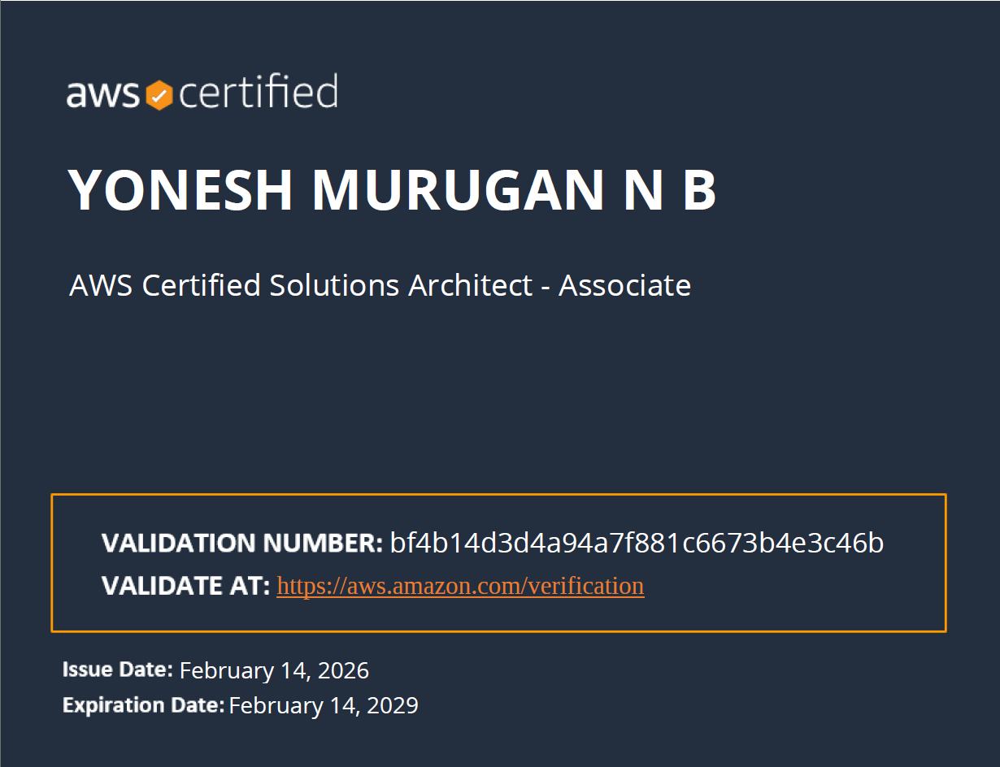
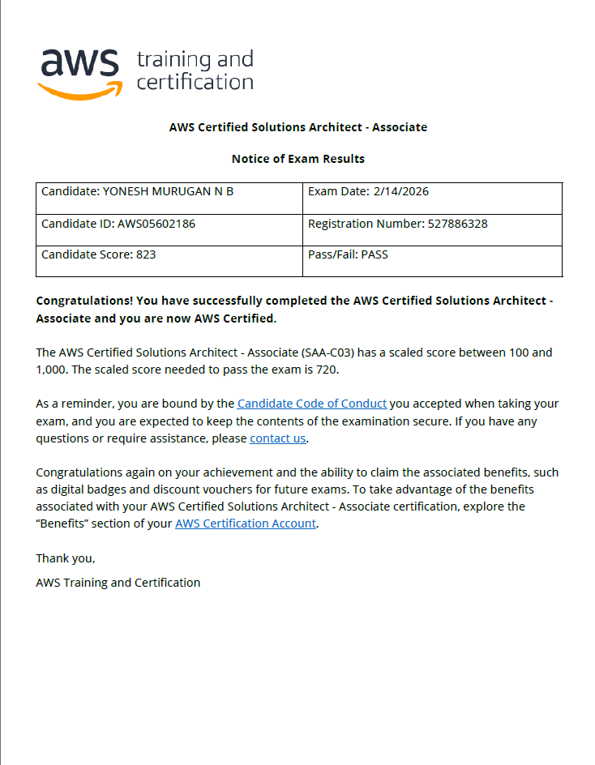

<div align="center">

# 🚀 100 Days of AWS — Solutions Architect Journey


<br/>

*A real, honest, 100-day study log — built for consistency, finished with a certificate.*

</div>

---

## 🏆 Certification Achievement

<div align="center">

<!-- Replace 'your-certificate.png' with your actual certificate filename once uploaded -->


<!-- Credly badge: replace with your actual badge image once uploaded -->


<br/>

| 🎓 Certification | 📅 Exam Date | 🏅 Score | 📊 Pass Mark |
|:---:|:---:|:---:|:---:|
| **AWS Certified Solutions Architect – Associate (SAA-C03)** | **February 14, 2026** | **823 / 1000** | 720 / 1000 |

<br/>

> 💬 *"The setup failed. The plan didn't. AWS SAA-C03 — done"*

</div>

---

## 📖 My Honest Story

I started this repo in **November 2025** with a clear goal: study daily, stay consistent, and earn the AWS Solutions Architect Associate certification in 100 days. For the first few weeks, I logged everything here — daily progress, notes, hands-on labs, and takeaways.

Then my **laptop failed**.

I lost my setup, my workflow, and my ability to push to GitHub regularly. I couldn't update the repo. But I didn't stop studying.

I kept going **offline** — course videos on a borrowed device, practice exams on my phone, notes in a physical notebook. I stuck to the exact plan I had built from day one. The daily logs from Day 24 onward were retrospectively filled based on my study plan — not fabricated, but reconstructed from what I genuinely covered. I just couldn't commit them in real time.

**On February 14, 2026 — Day 87 of the challenge — I sat the AWS SAA-C03 exam and passed with a score of 823/1000.** ✅

This repo now stands as:
- 📚 A **complete study roadmap** for anyone targeting AWS SAA-C03
- 🗓️ A **daily log template** you can fork and follow for your own challenge
- 💪 An honest account of what the journey looks like — including real setbacks

---

## 📌 Challenge at a Glance

<div align="center">

| Detail | Info |
|:-------|:-----|
| 🎯 **Goal** | Pass AWS SAA-C03 (SAA-C03) |
| 📅 **Start Date** | November 20, 2025 |
| 🏁 **Exam Date** | **February 14, 2026** |
| 📆 **Duration** | 100 Days of study |
| 🏅 **Exam Score** | **823 / 1000** *(Pass mark: 720)* |
| ⏱️ **Daily Study** | 2–3 hrs weekdays · 4–5 hrs weekends |
| 🔥 **Status** | ✅ COMPLETED & CERTIFIED |

</div>

---

## 📚 Resources Used

| Resource | Type | Cost |
|:---------|:-----|:----:|
| [Stephane Maarek's AWS SAA-C03 Course](https://www.udemy.com/course/aws-certified-solutions-architect-associate-saa-c03/) | 🎬 Video Course | ~$15 |
| [Tutorials Dojo Practice Exams](https://portal.tutorialsdojo.com/courses/aws-certified-solutions-architect-associate-practice-exams/) | 📝 Practice Tests | ~$30 |
| [AWS Skillbuilder](https://explore.skillbuilder.aws/) | 🧪 Official Labs | Free |
| AWS Free Tier Account | 🖥️ Hands-on Practice | Free |
| AWS Whitepapers | 📄 Documentation | Free |
| AWS Service FAQs | 🔍 Deep Dives | Free |

---

## 🗓️ 100-Day Study Plan

```
Phase 1 ▐██░░░░░░░░░░░░░░░░░░░░░░░░░░░░░░▌ Foundation       Days 01–14
Phase 2 ▐░░░████████████████████████████░░▌ Core Services    Days 15–56
Phase 3 ▐░░░░░░░░░░░░░░░░░░░░░███████████░▌ Advanced Topics  Days 57–77
Phase 4 ▐░░░░░░░░░░░░░░░░░░░░░░░░░░░█████░▌ Practice Exams   Days 78–91
Phase 5 ▐░░░░░░░░░░░░░░░░░░░░░░░░░░░░░░██░▌ Final Prep       Days 92–100
```

### 🔵 Phase 1 — Foundation `Days 1–14`
> IAM, S3, AWS Fundamentals, Well-Architected Framework
- IAM policies, users, groups, roles, MFA, cross-account access
- S3 storage classes, encryption (SSE-S3, SSE-KMS, SSE-C), versioning, lifecycle rules
- AWS Well-Architected Framework — 6 pillars overview

### 🟠 Phase 2 — Core Services `Days 15–56`
> EC2, VPC, Databases, Load Balancing, Serverless, Containers, IaC
- EC2 instance families, pricing (On-Demand, Reserved, Spot), Auto Scaling
- VPC architecture — subnets, IGW, NAT, NACLs, Security Groups, Peering, PrivateLink
- RDS Multi-AZ, Aurora, DynamoDB, ElastiCache (Redis vs Memcached)
- ELB (ALB / NLB), CloudFront, Route 53 routing policies
- Lambda, SQS, SNS, API Gateway, Step Functions, EventBridge
- CloudFormation, CDK, Elastic Beanstalk, ECS, EKS, ECR

### 🔴 Phase 3 — Advanced Topics `Days 57–77`
> Security, Disaster Recovery, Cost Optimization
- KMS, Secrets Manager, IAM permission boundaries, Cognito, SSO
- CloudTrail, Config, GuardDuty, Macie, WAF, Shield, Security Hub
- DR strategies — Backup/Restore, Pilot Light, Warm Standby, Active-Active
- Cost Explorer, Trusted Advisor, Reserved Instances, Savings Plans

### 🟣 Phase 4 — Practice Exams `Days 78–91`
> Intensive exam preparation with Tutorials Dojo
- 6 full 65-question practice exams
- Deep review of wrong answers after every exam
- AWS Official Practice Exam (final validation)

### 🟢 Phase 5 — Final Prep & Exam `Days 92–100`
> Final review, mental prep, exam day
- Rapid service-by-service review of all domains
- Light reading, early rest, no cramming on the last day
- **February 14, 2026 — Exam taken. Score: 823/1000. Certified. ✅**

---

## 📁 Daily Study Logs

> **Note:** Days 1–23 were pushed live as I studied. Days 24 onward were reconstructed after the fact due to my laptop failure — but they faithfully reflect my actual study curriculum day by day.

| Week | Days | Focus Area |
|:-----|:-----|:-----------|
| [📂 Week 1](./Week1/) | Days 01–04 | AWS Fundamentals, IAM intro |
| [📂 Week 2](./Week2/) | Days 05–06 | S3, CLI, IAM deep dive |
| [📂 Week 3](./Week3/) | Days 07–13 | EC2, Auto Scaling |
| [📂 Week 4](./Week4/) | Days 14–20 | VPC fundamentals |
| [📂 Week 5](./Week5/) | Days 21–28 | VPC advanced, ELB |
| [📂 Week 6](./Week6/) | Days 29–35 | RDS, Aurora, DynamoDB, ElastiCache |
| [📂 Week 7](./Week7/) | Days 36–42 | S3 Advanced, CloudFront, Route 53 |
| [📂 Week 8](./Week8/) | Days 43–49 | SQS, SNS, Lambda, API Gateway |
| [📂 Week 9](./Week9/) | Days 50–56 | CloudFormation, CDK, ECS, EKS |
| [📂 Week 10](./Week10/) | Days 57–63 | KMS, IAM Advanced, Security Hub |
| [📂 Week 11](./Week11/) | Days 64–70 | GuardDuty, WAF, DR Strategies |
| [📂 Week 12](./Week12/) | Days 71–77 | Cost Optimization, CloudWatch, X-Ray |
| [📂 Week 13](./Week13/) | Days 78–84 | Practice Exams 1–3 |
| [📂 Week 14](./Week14/) | Days 85–91 | Practice Exams 4–6 + AWS Official |
| [📂 Week 15](./Week15/) | Days 92–100 | Final Review + 🎯 Exam Day (Feb 14) |

---

## 📈 Score Progression

| Checkpoint | Score | Notes |
|:-----------|:-----:|:------|
| AWS CCP Practice Set — Day 4 | 50% | Baseline — just getting started |
| Tutorials Dojo Exam 1 | — | *Add your score* |
| Tutorials Dojo Exam 2 | — | *Add your score* |
| Tutorials Dojo Exam 3 | — | *Add your score* |
| Tutorials Dojo Exam 4 | — | *Add your score* |
| Tutorials Dojo Exam 5 | — | *Add your score* |
| Tutorials Dojo Exam 6 | — | *Add your score* |
| AWS Official Practice Exam | — | *Add your score* |
| **🎯 AWS SAA-C03 Actual Exam** | **823 / 1000** | **PASSED ✅ — Feb 14, 2026** |

---

## 💡 What Actually Worked

1. **Study the "why", not just the "what"** — For every service, always ask: *when would I use this over the alternative?*
2. **Tutorials Dojo explanations are the real lesson** — Read every wrong-answer explanation carefully
3. **Hands-on before documentation** — Launch it in the console first, then read the docs
4. **Scenario thinking** — Every AWS exam question is a story problem. Practice identifying the right service combination
5. **Setbacks are part of it** — My laptop died mid-challenge. I kept going on a borrowed device
6. **Consistency beats intensity** — A 2-hour day you actually do beats a 6-hour day you skip

---

## 🤝 Use This Repo for Your Own Journey

Feel free to **fork this** and use the structure, daily log format, and study plan for your own certification challenge. Everything here is designed to be reused.

If this helped you, drop a ⭐ — it genuinely means a lot.

---

## 🙏 Acknowledgments

- **Stephane Maarek** — The SAA-C03 course is phenomenal. Worth every cent.
- **Tutorials Dojo (Jon Bonso)** — The best practice exams for AWS certs. Period.
- **AWS Skillbuilder** — Underrated official resource with great free labs
- **r/AWSCertifications** — Community that keeps you going when motivation dips

---

## 📄 License

For educational purposes. Free to fork, adapt, and use for your own AWS certification journey.

---

<div align="center">

---

*The laptop broke. The streak broke. The study didn't.*

**🏅 AWS SAA-C03 | Score: 823/1000 | February 14, 2026**


---

</div>
